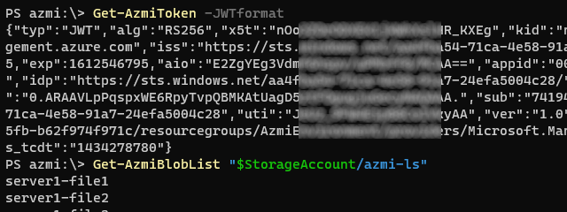

# PS-azmi

This PowerShell module simplifies operations against Azure cloud ☁ resources, like storage accounts and key vault.
The biggest difference between these and other Azure commands is that these do not require additional commands for Azure authentication.
Authentication is done transparently for the running session using Azure Managed Identity.

Your code can be absolutely free of any secrets, you do not even need to store user names!
Read more about Azure Managed Identities at [MS Docs web site](https://docs.microsoft.com/en-us/azure/active-directory/managed-identities-azure-resources/overview).

This PowerShell module is written in C# compiled with [.NET 5.0](https://docs.microsoft.com/en-us/dotnet/core/dotnet-five). It is targeting [PowerShell version 7](https://docs.microsoft.com/en-us/powershell/scripting/whats-new/what-s-new-in-powershell-70?view=powershell-7.1).

## How to use

In order to use commands from this module you need to setup your environment.
This is where all magic (transparent authorization and authentication) is actually happening.
You need a VM and a target resource that you want to access, like Storage Account or Key Vault.

### Prepare the environment

You can assign access in two ways:
1) System Assigned Managed Identity

On target resource, just assign access to your VM. More info [here](https://docs.microsoft.com/en-us/azure/active-directory/managed-identities-azure-resources/tutorial-linux-vm-access-arm).

2) Using User Assigned Managed Identity

Create new managed identity and assign it to your VM.
On target resource grant appropriate access rights to the identity.

If you want to assign the same access to multiple VMs, this is the preferred method.

### Install the module

Then, inside your Azure VM install this module

```PowerShell
Install-Module PS-azmi
# or
git clone https://github.com/iricigor/PS-azmi
Import-Module PS-azmi/azmi.dll
```

And that is all! Now you can use commands from the module, and authentication will be done transparently
```PowerShell
Get-AzmiToken -JWTFormat
Get-AzmiBlobList"$StorageAccount/azmi-ls"
```



## List of Commandlets

The following commandlets are implemented or planned:
- 🔑 Common
  - [x] **`Get-AzmiToken`** - Obtains Azure authentication token for use in commands outside of this module
- 💾 Blob
  - [x] **`Get-AzmiBlobList`** - List all blobs from container
  - [x] **`Get-AzmiBlobContent`** - Downloads one or more storage blobs to a local file
  - [x] **`Set-AzmiBlobContent`** - Uploads a local file or directory to an Azure Storage blob or container
- 🔐 Secret
  - [x] **`Get-AzmiSecret`** - Gets the secrets from Azure Key Vault
  - [ ] **`Set-AzmiSecret`** - Creates or updates a secret in a Azure Key Vault
- 🧾 Certificate
  - [x] **`Get-AzmiCertificate`**
  - [ ] **`Set-AzmiCertificate`**


All commands support argument `-Identity` (managed identity client ID), which can be skipped if VM has exactly one managed identity.

All commands support also argument `-Verbose`, which will produce additional output about commandlet execution to verbose output stream.

For more information on a specific command check their respective web pages:
- [Get-AzmiToken](./docs/Get-AzmiToken.md)
- [Get-AzmiBlobList](./docs/Get-AzmiBlobList.md)
- [Get-AzmiBlobContent](./docs/Get-AzmiBlobContent.md)
- [Set-AzmiBlobContent](./docs/Set-AzmiBlobContent.md)
- [Get-AzmiSecret](./docs/Get-AzmiSecret.md)
- [Get-AzmiCertificate](./docs/Get-AzmiCertificate.md)

## Links

Project is based on a `azmi` Linux CLI project - https://github.com/SRE-PRG/azmitool

Related documentation links:
- How to write a PowerShell cmdlet at [MS Docs web site](https://docs.microsoft.com/en-us/powershell/scripting/developer/cmdlet/how-to-write-a-simple-cmdlet?view=powershell-7.1)
- Azure Managed Identities at [MS Docs web site](https://docs.microsoft.com/en-us/azure/active-directory/managed-identities-azure-resources/overview)
- Pester documentation at [netlify.app](https://pester-docs.netlify.app/)

## Testing Pipelines

Testing this module presents a challenge, because traditional pipelines do not support managed identity.
Therefore, it is required to have a private pipeline agent on a dedicated ADO pool for module integration testing.

|Test|Results|
|-|-|
| Integration tests | [](https://dev.azure.com/iiric/azmi/_build/latest?definitionId=39&branchName=master) [](https://dev.azure.com/iiric/azmi/_build/latest?definitionId=39&branchName=master)

